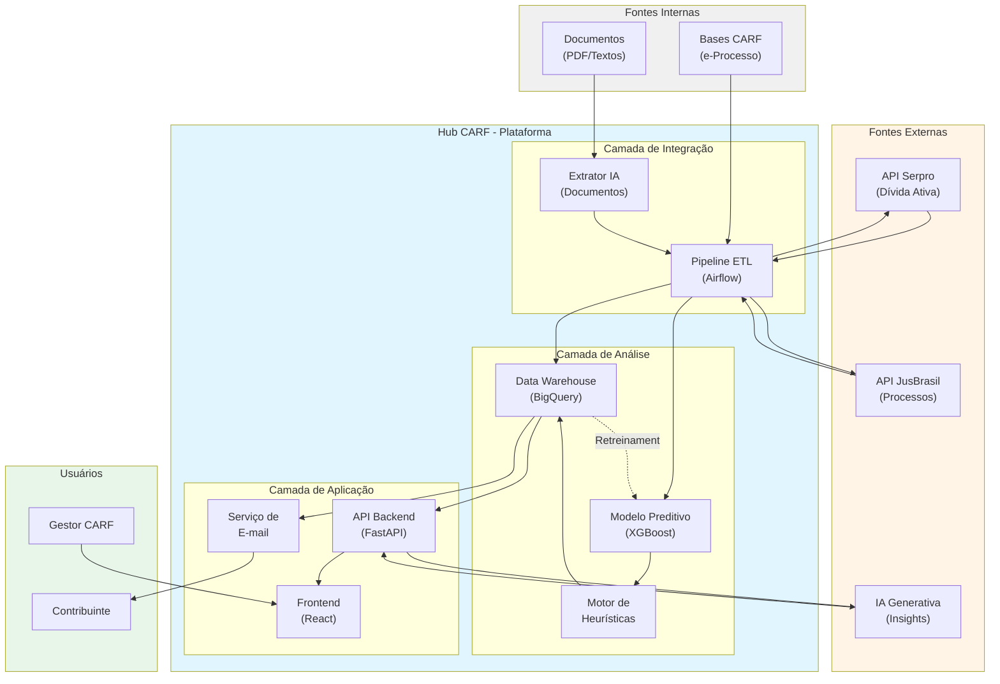

# Esquema da Solução

&emsp;O Hub CARF é uma plataforma de inteligência preditiva *full-stack*, desenvolvida em uma arquitetura de microsserviços moderna, orquestrada via Docker Compose. A solução foi projetada para ser flexível, escalável e de rápida implantação em qualquer ambiente de nuvem (PaaS/IaaS) ou *on-premise* que suporte contêineres.

&emsp;A arquitetura é dividida em três camadas principais: a **Camada de Integração de Dados** (responsável pela ingestão e enriquecimento), o **Motor de Análise Preditiva** (o cérebro da solução) e a **Camada de Aplicação e APIs** (que entrega o valor ao usuário).

---

## 1. Arquitetura Geral (Visão Lógica)

O fluxo de dados segue uma lógica de *pipeline* automatizado, desde a ingestão até a visualização:

1.  **Ingestão:** Novos processos são identificados nas bases do CARF.
2.  **Enriquecimento:** O *Data Integration Layer* busca dados contextuais nas APIs externas (Serpro, JusBrasil).
3.  **Processamento:** O *Extrator de IA* analisa documentos (PDFs/textos) e estrutura os dados.
4.  **Predição:** Os dados estruturados são enviados ao *Process Analytics Engine* (modelo XGBoost) para calcular o tempo estimado.
5.  **Armazenamento:** Os dados brutos, enriquecidos e a predição são armazenados no *Data Warehouse* (BigQuery).
6.  **Ação:** A API dispara o e-mail transacional para o contribuinte.
7.  **Visualização:** O *Frontend* (React) consome os dados da API (FastAPI) para exibir os *dashboards* aos gestores.
8.  **Insight:** O gestor solicita uma explicação no *dashboard*, e a API aciona a IA Generativa (LLM) para interpretar os dados e gerar o *insight*.

---

## 2. Componentes Tecnológicos (Stack)

| Camada | Componente | Tecnologia | Responsabilidade |
| :--- | :--- | :--- | :--- |
| **Orquestração** | Contêineres | **Docker Compose** | Gerencia e interconecta todos os serviços da aplicação, garantindo portabilidade. |
| **Frontend** | Aplicação Web | **React (Vite) + TailwindCSS** | Interface do usuário (Dashboards), experiência do gestor, alinhada ao padrão Gov.br. |
| **Backend (API)** | API Gateway | **FastAPI (Python)** | Ponto central de comunicação. Serve os dados ao *frontend* e gerencia a lógica de negócio. |
| **Data Pipeline** | Orquestrador de ETL | **Apache Airflow** | Automatiza e agenda os *pipelines* de ingestão, enriquecimento e (re)treinamento dos modelos. |
| **Banco de Dados** | Data Warehouse | **Google BigQuery** | Armazena os dados processuais históricos e as predições para análise em larga escala. |
| **Analytics (ML)** | Modelo Preditivo | **XGBoost / Scikit-learn** | O modelo de *Machine Learning* treinado que realiza a predição do tempo de julgamento. |
| **Analytics (IA)** | Extrator de Documentos | **LLM (Modelo Local/API)** | Módulo de IA que lê documentos (ex: despachos, petições) e extrai variáveis-chave. |
| **Analytics (IA)** | Gerador de Insights | **API LLM (Gemini/GPT)** | IA Generativa que interpreta os gráficos e dados, fornecendo explicações em linguagem natural. |

---

## 3. Detalhamento dos Módulos Principais

### Data Integration Layer (Alimentado pelo Airflow)

Este módulo é o coração da ingestão de dados.
* **Conectores Internos:** Monitora as bases de dados do CARF (via e-Processo ou *views* de banco de dados) para identificar novos processos ou atualizações de status.
* **Conectores Externos (APIs):** Para cada novo processo, dispara requisições às APIs da **Serpro** (para status de Dívida Ativa) e **JusBrasil** (para contexto de litígios judiciais), usando o CNPJ/CPF do contribuinte como chave.
* **Extrator de IA:** Utiliza um modelo de linguagem para processar textos não estruturados (documentos do processo) e extrair *features* cruciais para o modelo, como:
    * `quantidade_folhas_provas`
    * `quantidade_temas`
    * `valor_processo`
    * `tipo_diligencia`

### Process Analytics Engine (O Cérebro Preditivo)

Este módulo é onde a inteligência é gerada.
* **Serviço de Inferência (FastAPI Endpoint):** Expõe o modelo XGBoost treinado. Ele recebe o vetor de *features* (dados internos + externos + extraídos) e retorna a predição em dias.
* **Refinamento Heurístico:** A API aplica uma camada de regras de negócio sobre a predição bruta do modelo. Por exemplo, ela consulta os dados da Serpro/JusBrasil e, caso identifique um "contribuinte com alto índice de litígio", aplica um ajuste (ex: +15% de tempo) na estimativa final, tornando-a mais realista.
* **Serviço de Retreinamento (Airflow DAG):** Periodicamente (ex: semanalmente), um *job* do Airflow coleta os dados de processos recém-concluídos, recalcula as *features* e retreina o modelo XGBoost, garantindo o aprendizado contínuo e a adaptação do modelo a novas realidades processuais.

### CARF API Gateway & Application Layer

Esta é a camada que entrega o valor ao usuário final.
* **API (FastAPI):** Serve todos os *endpoints* necessários para o *dashboard* em React (ex: `/processos`, `/stats_turmas`, `/predicao/:id`).
* **Serviço de E-mail (SES/SendGrid):** Consome uma fila de eventos. Assim que uma nova predição é salva no BigQuery, um evento é disparado, e este serviço formata e envia o e-mail transacional ao contribuinte.
* **Endpoint de Insights (GenAI):** Quando um gestor clica em "Explicar este gráfico", o *frontend* envia os dados do gráfico (ex: um JSON) para o *endpoint* `/insights`. A API formata um *prompt* otimizado, consulta a API do LLM (ex: Gemini) e retorna a explicação em linguagem natural para o usuário.

---

## 4. Esquema Visual da Arquitetura

